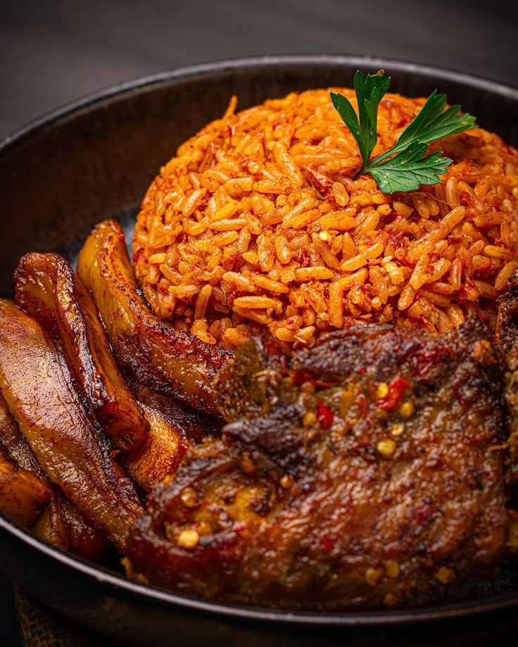

# Coding Class Cooks

This is a git repository we use to learn about git by creating recipes

## jollof rice recipe

### About the recipe

this is a popular african delicacy made with riceiit can be either smoky or spicy it can also be vegan.

 ### preparatoin
you need rice, pepper, onions,tomatos,garlic,you also need spices like knor cube,pepper,a pot ,and a spoon to ster
 ### the cooking
first you biol the rice until it is soft which is appromatly 40-41 minutes.then while you are boiling the rice ,blend your onions,pepper,tomatos,and garlic.then when your rice is soft pourthe things you blended into the rice and mix thoroughly and letthe water disolve into the rice and continue to mix
 ### what it looks like

 ### what you can add 
you can add planten meat and vegetables.